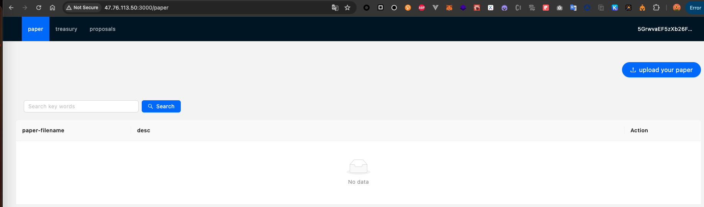
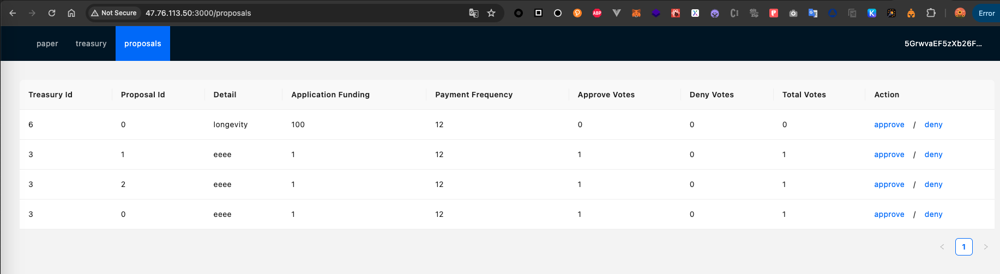

# d-science-frontend
Deployed URL: http://47.76.113.50:3000/

## 1 paper page
a we can upload and download paper in this page 

b we can search paper by paper filename

## 2 treasury page
a we can create science treasury for every one
b we can donate treasury
c we can crate proposal for treasury

## 3 proposals page
a we can see all the science proposals
b we can approve/deny the proposal which donate to the proposal owner treasury
c 2/3 donors approved the proposal, the block chain will send asset to proposals applicant installment

## Usage

- Install all dependencies `pnpm install`

- Build under development mode `pnpm dev`

- Build under production mode `pnpm build`

- Preview web page `pnpm preview`

- Unit test or integration test `pnpm test`

- Other scripts can be viewed in package.json

## Packages

✅ Zustand

✅ react-route-dom

✅ TypeScript

✅ Axios

✅ Vitest

✅ Testing Library

✅ react-query

✅ react-error-boundary

✅ ESLint

✅ Prettier

✅ Stylelint

✅ PostCSS

✅ Cypress

✅ folder(pages, routes, apis, assets, hooks, components, stores, styles, utils)

✅ alias(@pages, @routes, @apis...)

✅ eslint config(use eslint-config-proste)

✅ stylelint config

✅ editor config
